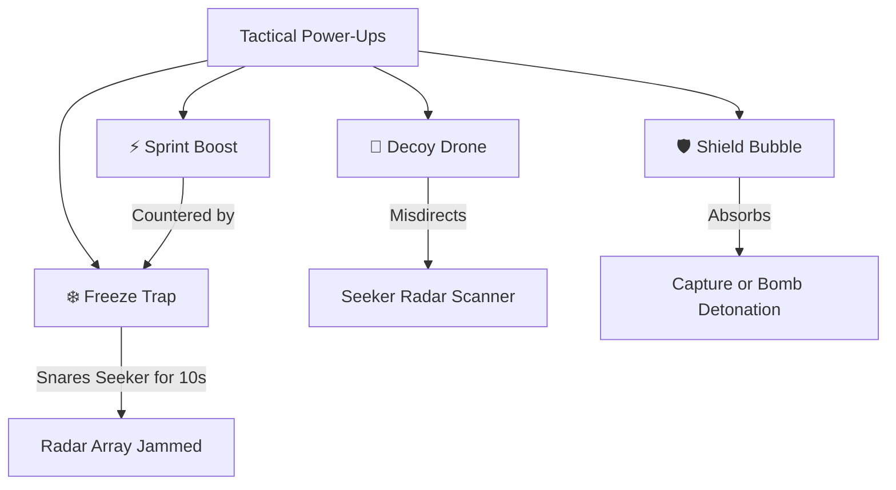

# 🏃 Bountyrunner: Comprehensive Game Design & Product Inspiration Dossier
*Elevating Real-World Outdoor GPS Gaming for Kids, Families, and Competitive Athletes*

---

## 1. Executive Vision & Philosophy

**Bountyrunner** bridges the gap between digital mobile gaming and visceral physical play. Think of it as **"Pokémon GO meets Laser Tag, Boksen Går, and Among Us"** in the real world.

For the past decade, mobile games have increasingly tethered players—especially kids and teenagers—to couches, screens, and microtransaction treadmills. Meanwhile, traditional outdoor play has struggled against hyper-stimulating digital feeds. Bountyrunner proves that mobile technology can be the **catalyst for real-world movement**, heart-pumping sprints, laughter across neighborhood parks, and social camaraderie.

### The Core Design Pillars
1. **Real-World Movement as Gameplay**: Your physical legs are your character controller. Your situational awareness of streets, trees, alleys, and hills is your tactical terrain.
2. **Audio-First "Screen-in-Pocket" Safety**: You should never look down at glass while running full sprint. Rhythmic synthesized audio cues, haptic vibrations, and spatial soundscape guide your pursuit and evasion.
3. **Instant Playground Accessibility**: No 15-minute tutorials, no mandatory email accounts, no pay-to-win mechanics. Host launches a match, friends scan a QR or enter a 4-letter code, and the game begins in under 30 seconds.
4. **Dual-Loop Psychology**: Accessible enough for an 8-year-old on a school playground, yet tactically rich enough for competitive adults doing HIIT cardio or corporate team building.

---

## 2. Player Psychology: Designing for Kids, Families & Competitive Adults

| Dimension | Kids & Tweens (Ages 7–14) | Family & Casual Groups | Competitive Adults (16–35+) |
| :--- | :--- | :--- | :--- |
| **Primary Motivation** | Pure kinetic energy, suspense of being chased, feeling like a secret agent or superhero. | Bonding, getting outside together, safe outdoor physical activity without frustration. | High-intensity interval training (HIIT), tactical outplay, radar bluffing, competitive leaderboards. |
| **Favorite Mode** | **Freeze Tag ("Boksen går")** & **Infection / Zombie Outbreak**. | **Geo-Bounty Skattejakt** (Treasure Hunt) & **Classic Hide & Seek**. | **Classic Tactical Pursuit** & **Ranked Turf Battles**. |
| **Frustration Threshold** | High if eliminated early and forced to sit out. | High if physical demands are unfair across different ages. | High if GPS latency or unfair mechanics compromise competitive balance. |
| **Key Design Solution** | Cooperative unfreeze rescues, zombie role-flip (never eliminated from play), and phantom decoys. | Scalable boundary zones (50m to 1000m), item collection roles, and customizable match duration. | Server-authoritative geodetic distance checks, microsecond-accurate tick engine, tactical power-up cooldowns. |

### The "Never Sit Out" Principle
The single biggest flaw of traditional childhood Tag ("Sisten") is that early eliminated players get bored and disengage. Bountyrunner solves this with three modern mechanics:
1. **Freeze Tag Rescues**: Tagged runners aren't dead—they are frozen in place. Teammates can risk their own safety to dash in, tap rescue within 10 meters, and grant both players a 3-second immunity shield to escape.
2. **Infection / Zombie Tag**: Caught hiders immediately swap roles into seekers. The game escalates in adrenaline as the survivor count dwindles, keeping 100% of players active until the final second.
3. **Geo-Bounty Scavenging**: Players who prefer exploration over raw sprinting can contribute by collecting virtual Energy Cubes and Bounty Crystals scattered around the perimeter, driving their team's XP pool.

---

## 3. Safety-First Architecture & Physical Geofencing

Player safety—especially for children—is paramount to Bountyrunner's credibility and viral adoption among parents, teachers, and municipalities.

```
       [ SAFETY ARCHITECTURE ]
                 │
  ┌──────────────┼──────────────┐
  ▼              ▼              ▼
Screen-in-    Speed Cap      Smart Park
Pocket Audio   (>25 km/h)    Geofencing
```

### A. Screen-in-Pocket Audio & Haptic Guidance
- **Problem**: Looking at a phone while sprinting creates trip hazards, collisions with trees or street furniture, and road danger.
- **Solution**: The app communicates vital proximity cues through procedural synthesized Web Audio and haptics:
  - **Proximity Sonar**: High-pitched sonar chimes accelerate in frequency as a seeker closes within 30m, 15m, and 5m.
  - **Radar Jam Warning**: Distinct icy glass chime sounds when a ground Freeze Trap is triggered.
  - **Zone Boundary Pulse**: A low-frequency warning hum vibrates if a player approaches the shrinking arena boundary.
  - **Match Status Cues**: Ascending major triad surges for phase start; heroic fanfare for victory; tactical debrief chord for defeat.
  - *Result*: Players keep their smartphone held safely against their chest or in a pocket/armband and look at the real physical terrain!

### B. Anti-Vehicle Velocity Limiting
- Any GPS update showing sustained speed $>25\text{ km/h}$ (approx $15.5\text{ mph}$) immediately pauses player tracking and displays a **"Vehicle Velocity Detected — Player Paused"** banner.
- This prevents players from cheating by hopping on electric scooters, motorbikes, or cars, ensuring fair athletic competition and keeping play strictly pedestrian.

### C. Safe Park Geofencing & Boundary Buffers
- Host match boundaries default to circular radial safe zones (e.g. 100m, 250m, 500m).
- In upcoming updates, integration with OpenStreetMap (OSM) park polygons will allow one-tap selection of certified public parks, sports complexes, schoolyards, and forest trails, preventing boundary circles from overlapping major arterial highways or dangerous waterways.

---

## 4. Game Modes Breakdown & Balance Mechanics

### 1. Classic Bountyrunner (Hunter vs Hiders)
- **Core Loop**: Hiders receive a head start (60–120s) to scatter into concealment within the arena. Seekers are released with proximity radar.
- **Dynamic Reveal Snapshots**: Every 60–120s, satellite radar ping snapshots project the hiders' exact coordinates for 5 seconds before going dark again, generating sudden bursts of pursuit.
- **Shrinking Arena**: Zone shrinks by 50–100m every 2 minutes, forcing hiders inward and guaranteeing climactic endgame encounters.

### 2. Freeze Tag ("Boksen Går")
- **Core Loop**: Seekers freeze runners upon tag. Frozen players cannot move or gather items.
- **Rescue Mechanic**: An unfrozen teammate who gets within 10 meters can hit **"RESCUE"** (+50 XP).
- **Grace Immunity**: Rescued runners receive 3,000ms of invulnerability (`frozenImmunityMap`), preventing instant spawn-camping by nearby seekers.

### 3. Infection Outbreak ("Zombie Tag")
- **Core Loop**: 1 or 2 initial seekers start as Patient Zero. Any caught hider immediately converts into a seeker.
- **Asymmetric Climax**: The final remaining hider becomes the **"Sole Survivor"**, receiving a +200 XP bounty and temporary continuous radar stealth to attempt to survive until match expiration.

### 4. Geo-Bounty Skattejakt (Treasure Hunt)
- **Core Loop**: Radial PRNG spawns 10 Energy Cubes (50 XP) and 4 rare Bounty Crystals (150 XP) within the arena boundary using Mulberry32 seeded math with high-latitude geodetic cosine correction.
- **Instant Extraction**: Players who navigate within 10 meters can tap **"GATHER"** to harvest the node. If all Bounty Crystals are secured, runners achieve an early Extraction Victory!

---

## 5. Tactical Power-Up Matrix

Tactical abilities add cognitive depth and counter-play beyond raw athletic speed:



| Power-Up | Duration | Cooldown | Tactical Function | Audio Signature |
| :--- | :--- | :--- | :--- | :--- |
| **⚡ Sprint Boost** | 15s | 45s | Expands capture/dodge mobility buffer by $\pm 6\text{m}$. | Ascending kinetic triplet (400Hz $\to$ 700Hz $\to$ 1200Hz). |
| **📡 Decoy Drone** | 30s | 60s | Projects a deceptive phantom GPS radar signature 80–120m away to confuse seeker radar sweeps. | Dual-tone cyber flutter (600Hz $\to$ 550Hz). |
| **🛡️ Shield Bubble** | 20s | 90s | Absorbs 1 capture attempt or bomb blast, granting the runner +50 XP and 3s escape grace. | Resonant crystalline bell chord (523Hz + 1046Hz). |
| **❄️ Freeze Trap** | 60s arm | 60s | Arms a 10m geofenced ground snare. Traps pursuing seekers for 10s and jams their radar array for 15s. | Mechanical snap click + sub-zero glassy overtone. |

---

## 6. Gamification, Daily Streaks & Progression Loops

To transform casual weekend play into an enduring daily habit, Bountyrunner introduces a deterministic progression framework:

### A. Daily Operations (Deterministic UTC Day Seed)
Every midnight UTC, 3 distinct mini-operations rotate deterministically:
- **Field Scout**: Complete at least 1 match (+100 XP).
- **Tactical Overtak**: Deploy 2 Tactical Power-Ups (+150 XP).
- **Kryptosamler**: Harvest 2 Energy Cubes or Bounty Crystals (+150 XP).
- **Boksen Går Redning**: Rescue a frozen teammate (+175 XP).
- **Lynrask Spurt**: Activate Sprint Boost during high-stakes pursuit (+125 XP).

### B. Daily Streak Counter 🔥
- Completing at least one match or daily operation each day increments the player's active streak.
- Maintaining a streak displays an animated fire badge (`🔥 X DAGER STREAK`) on their profile and in lobby rosters, creating authentic intrinsic pride.

### C. Unlockable Player Titles & Badges
Players equip fun identity titles that showcase their personal playstyle:
- **🏃 Sprek Gateløper** (Default): Always ready for a quick neighborhood sprint.
- **🥷 Skyggemester** (150 XP): Master of stealth and blind-spot evasion.
- **🤝 Redningshelt** (200 XP): Dashes through seeker crossfire to unfreeze teammates.
- **📡 Radar-ekspert** (300 XP): Reads proximity sensors with surgical accuracy.
- **💎 Gulljeger** (400 XP): Master scavenger of energy cubes and bounty crystals.
- **☣️ Zombiejeger** (500 XP): Relentless pursuer and outbreak specialist in infection mode.
- **⚡ Kvartalshelt** (1000 XP): Local neighborhood legend who knows every alleyway.

### D. Post-Match Celebration Ceremony
- Animated experience counter tallies earned XP with victory fanfare synthesis.
- Displays mode highlights: Rescues Executed, Crystals Gathered, Catches Made, and MVP performance.
- One-tap "Brag" button copies formatted results directly to clipboard for group chats (Snapchat, WhatsApp, Discord).

---

## 7. Viral Growth Loops & Community Features

```
          [ THE VIRAL SCHOOLYARD LOOP ]
                        │
       Host creates match in 1 tap (No Login)
                        │
         Display 4-letter Code + Quick QR
                        │
    Friends join on their own phones in 5 seconds
                        │
        High-energy 5–10 min outdoor match
                        │
       Post-Match XP & "Brag / Share" Screen
                        │
  Friends download app / create their own matches!
```

### 1. Instant QR Code & 4-Letter Squad Pairing
- Eliminates the friction of typing long URLs or passwords.
- Match host shows a clean QR code on their screen; friends point their camera and join within 5 seconds.
- Guest accounts require zero registration—all XP and progression save locally in browser storage, with seamless cloud account upgrade at any time.

### 2. Schoolyard Recess Tournaments & Turf Wars
- **Micro-Matches (5 minutes)**: Perfectly timed for school recess or lunch breaks.
- **Neighborhood Turf Leaderboards**: Track which team or player holds the highest XP in specific local postal codes or designated parks.
- **Class vs Class Battles**: School tournaments where grades compete for cumulative activity and sprint distance.

### 3. Ghost Trails & Run Replay (Strava for Gamers)
- Following match completion, a 2D map replay visualizes the full animated chase trail: where the hiders concealed themselves, where traps were laid, and the exact moment of interception.
- Sharable animated GIFs or video snippets for social media.

### 4. Spectator "Drone" Mode for Eliminated Players & Parents
- Eliminated runners or supervising parents can switch to Spectator Drone view, watching live icon pings across the park without interfering in gameplay comms.

---

## 8. Ethical Monetization & Brand Trust

Bountyrunner firmly rejects aggressive, predatory monetization:
- **Zero Pay-to-Win (P2W)**: Power-ups, sprint buffers, and radar ranges are 100% identical for all players regardless of spending.
- **Cosmetic Radar & Map Skins**: Vibrant neon Cyberpunk, Synthwave, Camouflage, and Retro 8-bit map themes.
- **Procedural Sound Packs**: Retro Arcade, Sci-Fi Mech, or Spooky Halloween sound suites.
- **Physical Event Licenses & Municipal Partnerships**: City recreation departments, school athletic programs, and summer camps licensing white-label Bountyrunner tournament instances.

---

## 9. Technical Architecture & Invariant Standards

To ensure flawless mobile execution, all UI, HUD, and backend components adhere to strict operational invariants:
- **Touch Target Accessibility**: Every action button (Power-Ups, Rescue, Bomb, Exit, Comms) maintains $\ge 44\times 44\text{px}$ touch target bounds.
- **Zero Micro-Fonts**: All typography is strictly $\ge 10\text{px}$ (`text-[10px]` or larger) to eliminate mobile squinting under direct sunlight.
- **Outdoor Sunlight High-Contrast Mode**: CARTO Positron vector tiles with darkened boundary circles and saturated contrast markers for high daylight visibility.
- **Serverless CAS Atomic Concurrency**: Collectibles and captures utilize optimistic concurrency with atomic check-and-set to guarantee zero double-pickup anomalies under poor 4G/5G mobile signals.

---
*Bountyrunner — Real World. Real Speed. Real Fun.*
